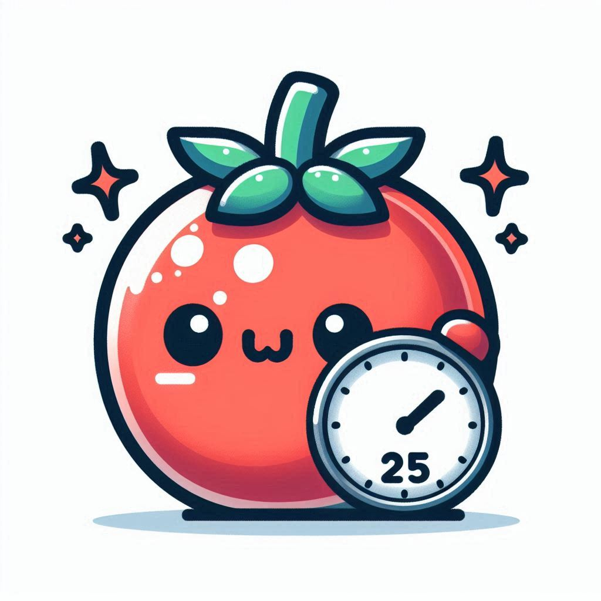

#  TomatoTranquil

> A self-designed project for UC Berkeley Cal Hacks x MTC: Hack for Good Night, developed with assistance from Claude-3.5-Sonnet AI and Gemini 2.5 Pro to promote mindful productivity and well-being.

TomatoTranquil is not just another Pomodoro timer - it's your mindful productivity companion that generates personalized, AI-powered break suggestions to help you stay refreshed and focused.

## ✨ What Makes It Special

Unlike traditional Pomodoro timers that only track time, TomatoTranquil integrates:
- **AI-Powered Break Ideas**: Uses Google's Gemini AI to generate contextual, mindful break suggestions
- **Flexible Break Durations**: Choose from 1, 2, 5, or 10-minute breaks to match your needs
- **Mindfulness Focus**: Each break suggestion encourages mental refreshment and physical well-being
- **Progress Tracking**: Keep track of your completed work sessions with a built-in counter

## 🚀 Features

- **Work Timer**
  - Customizable work duration (default: 25 minutes)
  - Visual progress bar
  - Easy +/- 5 minute adjustments
  
- **Smart Break Generator**
  - AI-generated mindful break suggestions
  - Activities suitable for desk-based breaks
  - Focus on stretching and mental refreshment
  
- **User Experience**
  - Clean, distraction-free interface
  - Sound notifications
  - Browser notifications (optional)
  - Mobile-responsive design
  - Session progress tracking

## 🛠️ Tech Stack

- Frontend: Vanilla JavaScript, HTML5, CSS3
- Backend: Node.js
- AI: Google Gemini API
- Deployment: Vercel

## 📦 Installation

1. Clone the repository:
```bash
git clone [your-repo-url]
cd mindful-break-hack
```

2. Install dependencies:
```bash
npm install
```

3. Set up your environment variables:
- Create a `.env` file in the root directory
- Add your Google Gemini API key:
```
GEMINI_API_KEY=your_api_key_here
```

4. Run the development server:
```bash
npm start
```

## 🌟 Usage

1. Set your desired work duration (1-60 minutes)
2. Start your work session
3. When the timer ends, you'll receive a notification
4. Choose your break duration
5. Click "Get Break Idea" for a personalized mindful break suggestion
6. Follow the suggestion during your break
7. Repeat for your next work session!

## 🤝 Contributing

Contributions are welcome! Feel free to:
- Submit bug reports
- Suggest new features
- Create pull requests
- Improve documentation

## 📝 License

This project is licensed under the MIT License - see the LICENSE file for details.

## 🙏 Acknowledgments

- Google Gemini:
  - Gemini API for powering our real-time break suggestions
  - Gemini 2.5 Pro model for development assistance and ideation
- Claude-3.5-Sonnet AI for development assistance and guidance
- The Pomodoro Technique® by Francesco Cirillo
- UC Berkeley Cal Hacks x MTC: Hack for Good Night
- All contributors and users of TomatoTranquil

---
Made with 🫶 for mindful productivity
